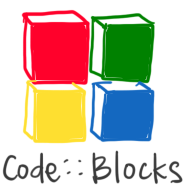
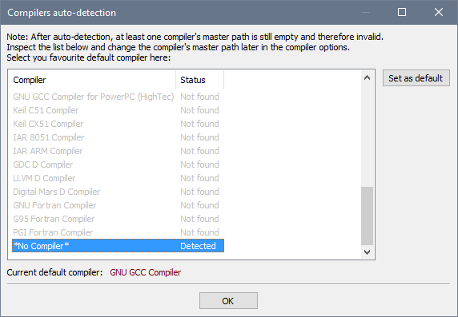
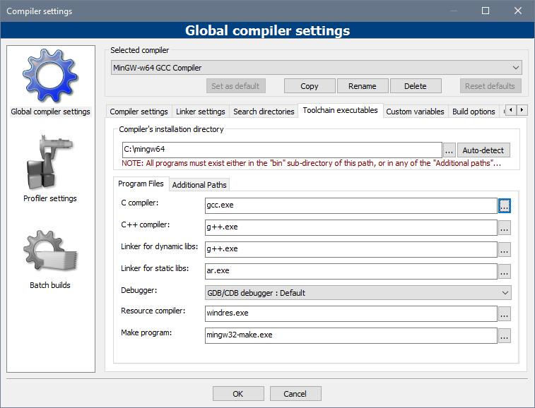
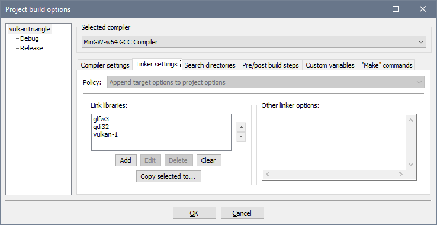
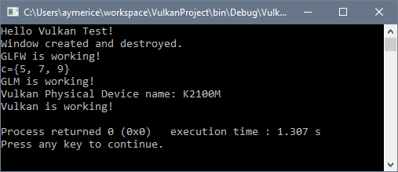

Use Code::Blocks for Vulkan development in Windows (64bit)
==========================================================





This guide is to setup a development environment for Vulkan, using MinGW-w64 as
compiler and Code::Blocks as IDE in Windows (64-bit). These are the basic
steps:

1. [MinGW-w64 setup](#mingw-w64_setup)
2. [Vulkan setup](#vulkan_setup)
3. [GLFW setup](#glfw_setup) (Optional, but highly recommended)
4. [GLM setup](#glm_setup) (Optional)
5. [Code::Blocks setup](#code__blocks_setup)

MinGW-w64 setup
---------------

Download the most recent MinGW-w64 compiler from [here][1]. There are several
versions, I usually prefer to download the most recent GCC using POSIX threads
and SEH exception handling. If you're wondering what's the difference between
SJLJ and SEH, take a look [here][3]. I prefer to download the POSIX threads
version in order to [enable C++11 multithreading features][4].

At the time of writing, the most recent version is [GCC 7.1.0 rev.2][2].

Uncompress the file in a short path, I usually use `C:\mingw64`.

Although it is not necessary, I like to have GCC tools available in the Windows
Command Prompt. To do this:

1. Open System Information (Win+Pause).
2. Click on "Advance System Settings".
3. Click on "Environmental Variables...".
4. In the "User variables..." section, click "New..." and create a variable
   named `PATH` (if you don't have one already), with the value
   `C:\mingw64\bin`.
5. Click "OK", click "OK", click "OK".
6. Open a Command Prompt (Press Win+R, type `cmd` and press Enter).
7. Type `gcc --version` and press Enter. You should see GCC's version
   information that match the version that you downloaded.


Vulkan setup
------------

Vulkan setup is pretty easy thanks to [LunarG Vulkan SDK][5]. Just download the
most recent Vulkan SDK for Windows and install it in it's default path.

At the time of writing, the most recent version is [1.0.61.1][6]. I installed
it into `C:\VulkanSDK` to keep paths short.


GLFW setup
----------

[GLFW][7] is a library that does many things (keyboard, mouse and windows
events, timing, etc.), but I use it mainly to create the Window and get access
to it's surface (in order to draw into them using Vulkan).

1. Fist download and extract the Windows pre-compiled binaries from [here][8].
2. Look into the extracted files and find a folder named `lib-mingw-w64`. Copy
   it's content (`libglfw3dll.a`, `libglfw3.a` and `glfw3.dll`) into
   `C:\mingw64\bin`.
3. Then go back and look for the `include` folder. Copy it's content (a folder
   called `GLFW`) into `C:\mingw64\x86_64-w64-mingw32\include`. You must copy
   the entire `GLFW` folder, or your source code won't be able to find GLFW's
   headers.


GLM setup
---------

[OpenGL Mathematics (OGL)][9] is a library that implements a lot of the
mathematics commonly used in graphics software. And because it is a header only
library, it is easy to install.

1. Download and extract latest GLM from [here][9]. At the time of writing,
   latest GLM is 0.9.8.5.
2. Find the `glm` directory and copy it into
   `C:\mingw64\x86_64-w64-mingw32\include`. You must copy the entire `glm`
   folder, or your source code won't be able to find GLM's headers.

I strongly recommend that you read GLM's manual, which is included inside the
`doc` folder. It gives a lot of advice on how to use and optimize GLM.


Code::Blocks setup
------------------

[Code::Blocks][10] is a lightweight IDE, similar to Eclipse or Visual Studio,
but it won't consume as much system's resources as those.

1. Download Code::Blocks binary release from [here][11]. Download the version
   named `codeblocks-XX.XX-setup.exe` to get an installer without MinGW,
   because we already installed MinGW-w64.
2. Run the installer and install Code::Blocks in it's default path.
3. By default Code::Blocks does not know how to use MinGW-w64, so we will
   configure it to use MinGW-w64.

    1. Run Code::Blocks. On first run, you will see a dialog similar to this:

       

       Code::Blocks won't auto-detect MinGW-w64 compiler (probably). So for now
       just choose "\*No Compiler\*", click "Set as Default" and click "OK".
    2. Now select the "Settings" menu, and click on "Compiler...".
    3. On "Selected compiler" choose "GNU GCC Compiler" and click on "Copy".
    4. Choose an appropriate name (like "MinGW-w64 GCC Compiler") and click
       "OK".
    5. Now go to the "Toolchain executables" and configure it like this:

       

       Note: you have to click on each of the "..." buttons and select the
       corresponding executable from the `C:\mingw64\bin` folder.
    6. Click on "Set as default" and click "OK". Now MinGW-w64 is selected as
       the default compiler for Code::Blocks projects.

4. Now we will create a user template for Vulkan projects. This is a long step,
   but it will save you time from compiler configuration in each new project
   that you do.

    1. Select menu "File->New->Project...".
    2. Click on "Empty project" and then "Go".
    3. For "Project title:" use "VulkanProject" and click "Next".
    4. Compiler should have "MinGW-w64 GCC Compiler" already selected, so just
       click "Finish".
    5. Now we have to configure the compiler so it knows the path to Vulkan
       headers. On the Management section (at the left), right click on
       "VulkanProject" and select "Build options...".
    6. On the left side, select "VulkanProject" instead of "Debug" or
       "Release", to be sure that the following configuration applies to both
       "Debug" and "Release" targets.
    7. I like to use the C++14 standard, so I usually select "Have g++ follow
       the C++14 ISO..." in the "Compiler flags" tab.
    8. Go to "Search Directories" tab, and into the "Compiler" tab click on
       "Add" button. Enter the following directory `%VULKAN_SDK%\Include` and
       click "OK". `%VULKAN_SDK%` is a system variable that the Vulkan SDK
       installer created, and it has the path to the Vulkan SDK.
    9. Go to the "Linker" tab (not the "Linker settings" tab) and click on
       "Add". Enter the following directory `%VULKAN_SDK%\Lib` and click "OK".
    10. Now go to the "Linker settings" tab, and add the following libraries
        into the "Link libraries:" section: `glfw3`, `gdi32` and `vulkan-1`.
        Then click "OK".

        

    11. Before we save the template, let's test if everything is configured
        right. Create a new file (menu "File->New->File..."), choose "C/C++
        source" and click "Go". For the language select "C++" and click "Next".
        For filename use `main.cpp` and use the "..." button to save the file
        in the root folder of the project. Then click on "Debug" and "Release"
        to add this file to both targets. Finally click "Finish".
    12. Copy this code into `main.cpp`:

        ```C++
        #include <iostream>
        #include <vector>

        #include <GLFW/glfw3.h>
        #include <glm/glm.hpp>
        #include <vulkan/vulkan.h>

        void testGLFW() {
            glfwInit();
            GLFWwindow* window =
                glfwCreateWindow(800, 600, "GLFW Test", nullptr, nullptr);
            (void)window; // This avoids a compiler warning
            glfwTerminate();
            std::cout << "Window created and destroyed." << std::endl;
            std::cout << "GLFW is working!" << std::endl;
        }

        void testGLM() {
            glm::vec3 a{1.0, 2.0, 3.0};
            glm::vec3 b{4.0, 5.0, 6.0};
            glm::vec3 c = a + b;
            std::cout << "c={"
                      << c.x << ", "
                      << c.y << ", "
                      << c.z << "}" << std::endl;
            std::cout << "GLM is working!" << std::endl;
        }

        void testVulkan() {
            // Create Vulkan instance
            VkApplicationInfo appInfo = {};
            appInfo.sType = VK_STRUCTURE_TYPE_APPLICATION_INFO;
            appInfo.pApplicationName = "Vulkan Test";
            appInfo.applicationVersion = VK_MAKE_VERSION(1, 0, 0);
            appInfo.pEngineName = "No Engine";
            appInfo.engineVersion = VK_MAKE_VERSION(1, 0, 0);
            appInfo.apiVersion = VK_API_VERSION_1_0;

            VkInstanceCreateInfo createInfo = {};
            createInfo.sType = VK_STRUCTURE_TYPE_INSTANCE_CREATE_INFO;
            createInfo.pApplicationInfo = &appInfo;

            VkInstance instance{VK_NULL_HANDLE};
            if (vkCreateInstance(&createInfo, nullptr, &instance) != VK_SUCCESS) {
                std::cerr << "Failed to create Vulkan instance!" << std::endl;
                return;
            }

            // Enumerate Vulkan Physical Devices
            uint32_t deviceCount = 0;
            vkEnumeratePhysicalDevices(instance, &deviceCount, nullptr);
            if (deviceCount == 0) {
                std::cerr << "Failed to find any Vulkan devices!" << std::endl;
                vkDestroyInstance(instance, nullptr);
                return;
            }

            std::vector<VkPhysicalDevice> devices{deviceCount};
            vkEnumeratePhysicalDevices(instance, &deviceCount, devices.data());
            for (const auto& device : devices) {
                VkPhysicalDeviceProperties deviceProperties{};
                vkGetPhysicalDeviceProperties(device, &deviceProperties);
                std::cout << "Vulkan Physical Device name: "
                          << deviceProperties.deviceName
                          << std::endl;
            }

            // Cleanup
            vkDestroyInstance(instance, nullptr);

            std::cout << "Vulkan is working!" << std::endl;
        }

        int main() {
            std::cout << "Hello Vulkan Test!" << std::endl;
            testGLFW();
            testGLM();
            testVulkan();
            return 0;
        }
        ```

    13. Compile (either by pressing Ctrl+F9 or by clicking on the gear icon).
        If everything is fine, you should see a *"0 error(s), 0 warning(s)..."*
        message in the "Build log" tab. If you run the program you should see
        something like this:

        

    14. Now that we know that everything is working, delete the `main.cpp`
        file. If we don't delete it, then every project created from our
        template will contain such file. First right click on "main.cpp" on the
        management section, then select "Remove file from project". Then
        delete the file from the project's folder.

    15. Finally, save the project as a template. Go to menu "File->Save project
        as template" and give it a meaningful name (like "Vulkan Project"). You
        can close and delete "VulkanProject".

5. To create a new Vulkan project, first create the folder where you want to
   save your project, for example `C:\workspace\newProject`. Then in
   Code::Blocks go to menu "File->New->Project...", select "User templates" on
   the left, select "Vulkan Project", then click on "Go". Choose the directory
   that you created (`C:\workspace\newProject`) and click "OK". Voila! Now you
   have a new Vulkan Project, with all compiler setting correctly configured.

And that's it! If you want to learn Vulkan, I recommend this [tutorial][12]. It
uses Visual Studio, but everything code related will work on Code::Blocks.  


[1]: https://sourceforge.net/projects/mingw-w64/files/Toolchains%20targetting%20Win64/
[2]: https://sourceforge.net/projects/mingw-w64/files/Toolchains%20targetting%20Win64/Personal%20Builds/mingw-builds/7.1.0/threads-posix/seh/x86_64-7.1.0-release-posix-seh-rt_v5-rev2.7z
[3]: https://stackoverflow.com/questions/15670169/what-is-difference-between-sjlj-vs-dwarf-vs-seh
[4]: https://stackoverflow.com/questions/17242516/mingw-w64-threads-posix-vs-win32
[5]: https://vulkan.lunarg.com/
[6]: https://vulkan.lunarg.com/sdk/home#sdk/downloadConfirm/1.0.61.1/windows/VulkanSDK-1.0.61.1-Installer.exe
[7]: http://www.glfw.org/
[8]: http://www.glfw.org/download.html
[9]: https://glm.g-truc.net/
[10]: http://www.codeblocks.org/
[11]: http://www.codeblocks.org/downloads
[12]: https://vulkan-tutorial.com/
